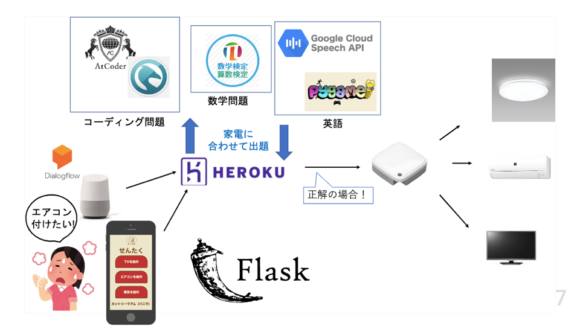

# スパルタルーム
## 概要
「最強のエンジニアになりたい！」  
そのためには、毎日プログラミング問題を解いて、毎日英語の勉強をして、あとは多分数学の勉強もすれば良さそう！！  
でも、そんなの自分だけじゃ続けられない。。怠けちゃう。。。どうしよう。。。

**そんな全ての悩めるエンジニアのために「スパルタルーム」を開発しました！**  
（kdghacks2019というハッカソンでチームで開発致しました。）

スパルタルームは、赤外線リモコンとアプリを連携させることで、  
家のあらゆる（赤外線で操作できる）家電の操作に勉強が必要になる環境を作り出すことができます。  

帰ってまず電気をつけようと思っても、まずプログラミングの問題を答えなくはつきません。   
エアコンをつけるときや温度を調整するときは、英語の問題を解かなくてはいけません。  
TVをつけるときは数学の問題を解かなくてはいけません。　　

## 技術

